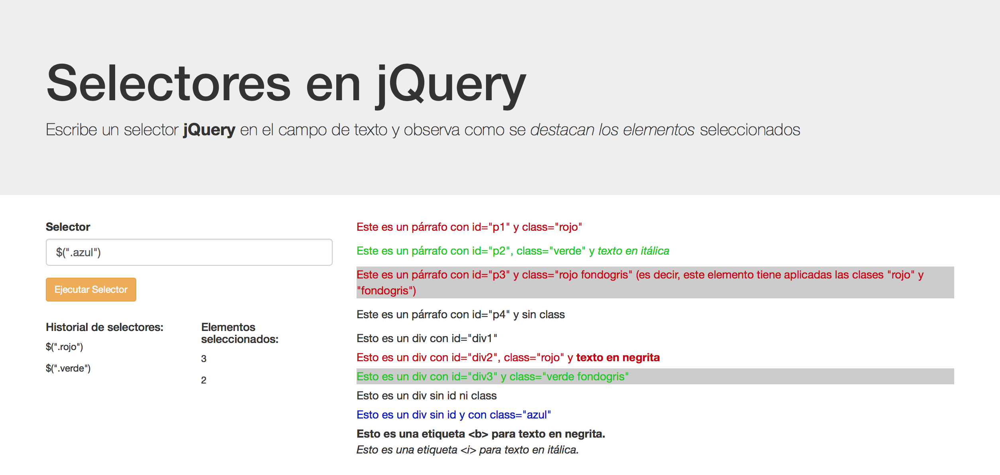

# Experiencia 23 - Actividad Presencial II
## jQuery Basics

El objetivo de esta actividad es aprender a implementar funcionalidades de la biblioteca jQuery en un sitio web.

#### Para realizar esta actividad debes haber visto los videos correspondientes a la semana 23.

## Ejercicio 1:
- Se tiene el siguiente archivo HTML:

~~~html
<html>
<head>
	<meta charset="UTF-8">
	<title>Selectores jQuery</title>
	

	

	<link rel="stylesheet" href="https://maxcdn.bootstrapcdn.com/bootstrap/3.3.7/css/bootstrap.min.css" integrity="sha384-BVYiiSIFeK1dGmJRAkycuHAHRg32OmUcww7on3RYdg4Va+PmSTsz/K68vbdEjh4u" crossorigin="anonymous">

    <!-- Latest compiled and minified JavaScript -->
	

</head>

<body>

	

		<h1>Selectores en jQuery</h1>

	
Escribe un selector <b>jQuery</b> en el campo de texto y observa como se <i>destacan los elementos</i> seleccionados

	

<main class="container">

	

		<form>
			

				<label for="camposelector">Selector</label>
				<input type="Text" name="camposelector" id="camposelector" class="form-control">
			

			<input type="button" id="boton" value="Ejecutar Selector" class="btn btn-warning btn-sm">
		</form>
		

			

				

					<h5>Historial de selectores:</h5>
				

			

			

				

					<h5>Elementos seleccionados:</h5>
				

			

		

		
	

	

		

			Este es un párrafo con id="p1" y class="rojo"
		

		

			Este es un párrafo con id="p2", class="verde" y <i>texto en itálica</i>
		

		

			Este es un párrafo con id="p3" y class="rojo fondogris" (es decir, este elemento tiene aplicadas las clases "rojo" y "fondogris")
		

		

			Este es un párrafo con id="p4" y sin class
		

		

			Esto es un div con id="div1"
		

		

			Esto es un div con id="div2", class="rojo" y <b>texto en negrita</b>
		

		

			Esto es un div con id="div3" y class="verde fondogris"
		

		

			Esto es un div sin id ni class
		

		

			Esto es un div sin id y con class="azul"
		

		<b>Esto es una etiqueta &lt;b&gt; para texto en negrita.</b>
		 
		<i>Esto es una etiqueta &lt;i&gt; para texto en itálica.</i>
	

</main>

</body>
</html>
~~~

El objetivo es implementar un algoritmo que permita escribir selectores jQuery en el input de texto, mostrar los elementos seleccionados e ir almacenando en el historial de los selectores válidos ejecutados y la cantidad de elementos seleccionados con cada uno.

Al presionar el **botón** "Ejecutar Selector", se requiere:

- Si el campo de texto se encuentra vacío, se debe mostrar un alert que diga "Debe ingresar un selector jQuery!".
	> Hint: Utiliza el método **.val()**

- Si el campo de texto **NO** se encuentra vacío, se debe evaluar el contenido.
	> Hint: Utilizar el método **eval()**.

- Si el campo de texto contiene texto que no corresponde a un selector, simplemente debe limpiar el texto ingresado.

- Si el campo de texto contiene un selector válido:

	- Destacar los elementos seleccionados.
	
		> Hint: Utiliza **fadeIn** y **fadeOut** o un método de tu elección.

	- Agregar el selector ingresado al div con class="historial" junto con la cantidad de elementos selecionados en el div con class="seleccionados".
	
		> Hint: Utiliza el método **.append()**
	
	- Limpiar el contenido del campo de texto.

**Imagen Referencial:**

